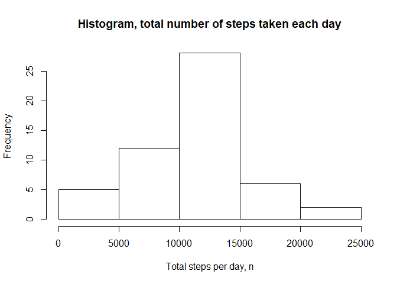
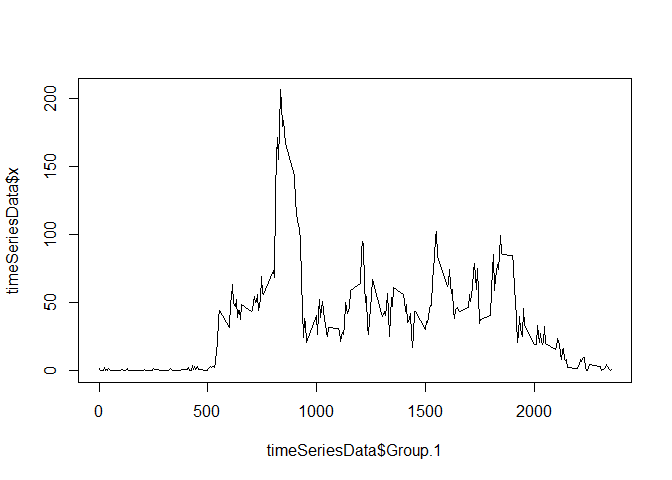
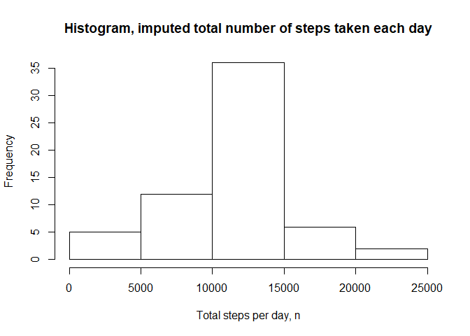
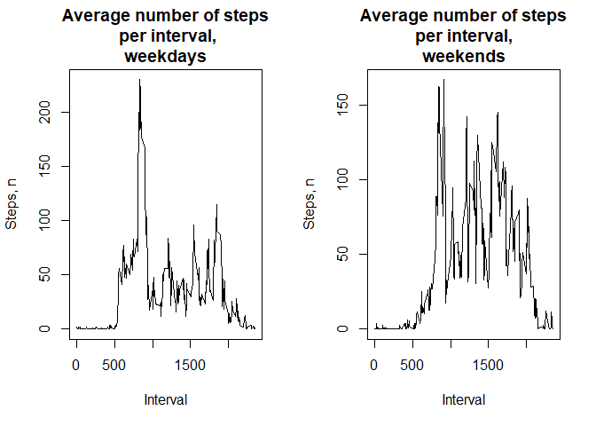

Make sure to always include the code that you used to generate the output you present.   


```r
knitr::opts_chunk$set(echo = TRUE)
##rmarkdown::render(clean=FALSE)
```

Load the data.  
Process/transform the data (if necessary) into a format suitable for analysis.  


```r
activity_raw <- read.csv("activity.csv")
summary(activity_raw)
```

```
##      steps                date          interval     
##  Min.   :  0.00   2012-10-01:  288   Min.   :   0.0  
##  1st Qu.:  0.00   2012-10-02:  288   1st Qu.: 588.8  
##  Median :  0.00   2012-10-03:  288   Median :1177.5  
##  Mean   : 37.38   2012-10-04:  288   Mean   :1177.5  
##  3rd Qu.: 12.00   2012-10-05:  288   3rd Qu.:1766.2  
##  Max.   :806.00   2012-10-06:  288   Max.   :2355.0  
##  NA's   :2304     (Other)   :15840
```

## What is mean total number of steps taken per day? 
  
For this part of the assignment, you can ignore the missing values in the dataset.  
1. Calculate the total number of steps taken per day.  
2. Make a histogram of the total number of steps taken each day.  


```r
##aggregate data to calculate total steps each day
totalStepsPerDay <- aggregate(activity_raw$steps, by=list(activity_raw$date), FUN=sum)
hist(totalStepsPerDay$x, main="Histogram, total number of steps taken each day", xlab="Total steps per day, n")
```

<!-- -->

3. Calculate and report the mean and median of the total number of steps taken per day.   


```r
options(scipen = 8)
meanStepsPerDay <- mean(totalStepsPerDay$x, na.rm=TRUE)
medianStepsPerDay <- median(totalStepsPerDay$x, na.rm=TRUE)

meanStepsPerDay
```

```
## [1] 10766.19
```

```r
medianStepsPerDay
```

```
## [1] 10765
```

The mean number of steps taken per day is 10766  
The median number of steps taken per day is 10765  
  
    
## What is the average daily activity pattern?  

1. Make a time series plot (i.e. type = "l") of the 5-minute interval (x-axis) and the average number of steps taken, averaged across all days (y-axis).  


```r
timeSeriesData <- aggregate(activity_raw$steps, by=list(activity_raw$interval), FUN=mean, na.rm=TRUE)
plot(timeSeriesData$Group.1, timeSeriesData$x, type="l")
```

<!-- -->


2. Which 5-minute interval, on average across all the days in the dataset, contains the maximum number of steps?
  

```r
timeSeriesData[which.max(timeSeriesData$x),1]
```

```
## [1] 835
```

The interval with the highest average step count is 835  
  

##Imputing missing values  
Note that there are a number of days/intervals where there are missing values (coded as NA). The presence of missing days may introduce bias into some calculations or summaries of the data.  

1. Calculate and report the total number of missing values in the dataset (i.e. the total number of rows with NAs)  

```r
length(activity_raw[which(is.na(activity_raw$steps)),1])
```

```
## [1] 2304
```
  
There are 2304 rows with missing values for steps in the raw dataset.  
  

2. Devise a strategy for filling in all of the missing values in the dataset. The strategy does not need to be sophisticated. For example, you could use the mean/median for that day, or the mean for that 5-minute interval, etc.  
  
3. Create a new dataset that is equal to the original dataset but with the missing data filled in.  
  

```r
##create a copy of the data table, that will have missing values imputed
activity_imputed <- activity_raw

##calculate mean values for each interval
meanPerInterval <- aggregate(activity_imputed$steps, by=list(activity_imputed$interval), FUN=mean, na.rm=TRUE)
names(meanPerInterval) <- c("Interval", "Mean steps")

##loop through imputed table, test for missing value in steps column at each position
for(i in 1:length(activity_imputed$steps)) if(is.na(activity_imputed$steps[i])) {
  ##if missing, get the row number of meanPerInterval that has the corresponding interval data
  rowNumber <- match(activity_imputed$interval[i], meanPerInterval$Interval)
  ##get the mean number of steps for that interval
  meanSteps <- meanPerInterval$`Mean steps`[rowNumber]
  ##replace the missing value with the mean value for that interval
  activity_imputed$steps[i] <- meanSteps
}
##check how many missing values left in activity_imputed
length(activity_imputed[which(is.na(activity_imputed$steps)),1])
```

```
## [1] 0
```

```r
##check that missing values are still in the activity_raw dataset
length(activity_raw[which(is.na(activity_raw$steps)),1])
```

```
## [1] 2304
```

  

4. Make a histogram of the total number of steps taken each day and Calculate and report the mean and median total number of steps taken per day. Do these values differ from the estimates from the first part of the assignment? What is the impact of imputing missing data on the estimates of the total daily number of steps?
  

```r
##aggregate data to recalculate total steps each day
imputedTotalStepsPerDay <- aggregate(activity_imputed$steps, by=list(activity_imputed$date), FUN=sum)
hist(imputedTotalStepsPerDay$x, main="Histogram, imputed total number of steps taken each day", xlab="Total steps per day, n")
```

<!-- -->

```r
##recalculate mean and median total steps per day
options(scipen = 8)
imputedMeanStepsPerDay <- mean(imputedTotalStepsPerDay$x, na.rm=TRUE)
imputedMedianStepsPerDay <- median(imputedTotalStepsPerDay$x, na.rm=TRUE)

imputedMeanStepsPerDay
```

```
## [1] 10766.19
```

```r
imputedMedianStepsPerDay
```

```
## [1] 10766.19
```

The mean number of steps taken per day is 10766 without imputation, and 10766 with imputation.  
The median number of steps taken per day is 10765 without imputation, and 10766 with imputation.     
  
Imputation with mean for given time interval has had very little impact on these estimates. 
  
##Are there differences in activity patterns between weekdays and weekends?  
  
  
For this part the weekdays() function may be of some help here. Use the dataset with the filled-in missing values for this part.  
  
1. Create a new factor variable in the dataset with two levels - "weekday" and "weekend" indicating whether a given date is a weekday or weekend day. 
  

```r
##add a new column called dayOfWeek
activity_imputed$dayOfWeek <- weekdays(as.Date(activity_imputed$date))
##reset values in dayOfWeek as either weekend or weekday 
for(i in 1:length(activity_imputed$dayOfWeek)) {
    if(activity_imputed$dayOfWeek[i] == "Saturday" | activity_imputed$dayOfWeek[i] == "Sunday") activity_imputed$dayOfWeek[i]  <- "weekend"
    else activity_imputed$dayOfWeek[i] <- "weekday"
}
##get summary of values held for dayOfWeek
levels(factor(activity_imputed$dayOfWeek))
```

```
## [1] "weekday" "weekend"
```


2. Make a panel plot containing a time series plot (i.e. type="l") of the 5-minute interval (x-axis) and the average number of steps taken, averaged across all weekday days or weekend days (y-axis). See the README file in the GitHub repository to see an example of what this plot should look like using simulated data.  
  

```r
##set layout for 1 rows, 2 columns - preferred, as easier to compare values when plots are side by side
par(mfrow=c(1,2))

##subset activity_imputed, retain either weekdays only or weekends only
weekdaysData <- activity_imputed[which(activity_imputed$dayOfWeek == "weekday"), ]
timeSeriesWeekdays <- aggregate(weekdaysData$steps, by=list(weekdaysData$interval), FUN=mean, na.rm=TRUE)
names(timeSeriesWeekdays) <- c("interval", "steps")

weekendData <- activity_imputed[which(activity_imputed$dayOfWeek == "weekend"), ]
timeSeriesWeekend <- aggregate(weekendData$steps, by=list(weekendData$interval), FUN=mean, na.rm=TRUE)
names(timeSeriesWeekend) <- c("interval", "steps")

##draw plots
plot(timeSeriesWeekdays$interval, timeSeriesWeekdays$steps, type="l", xlab="Interval", ylab="Steps, n", main="Average number of steps\n per interval,\nweekdays")
plot(timeSeriesWeekend$interval, timeSeriesWeekend$steps, type="l", xlab="Interval", ylab="Steps, n", main="Average number of steps\nper interval,\nweekends")
```

<!-- -->

